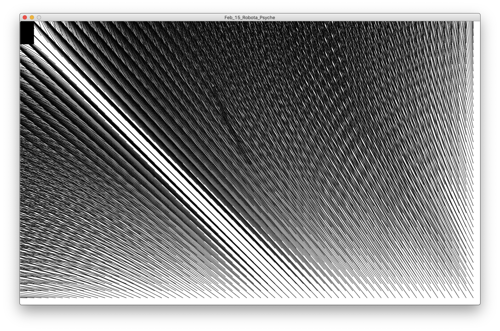
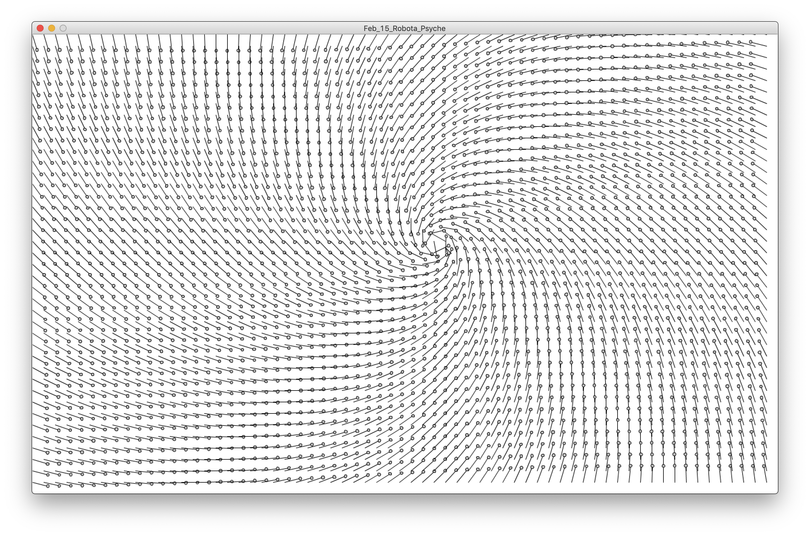
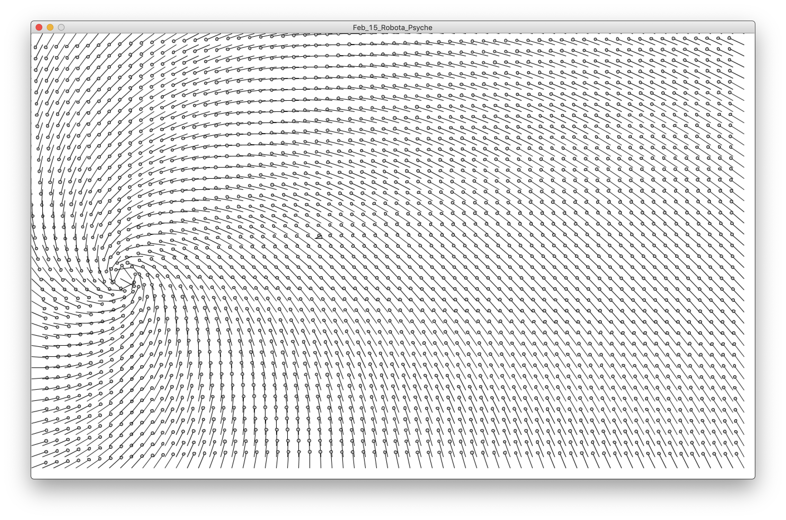
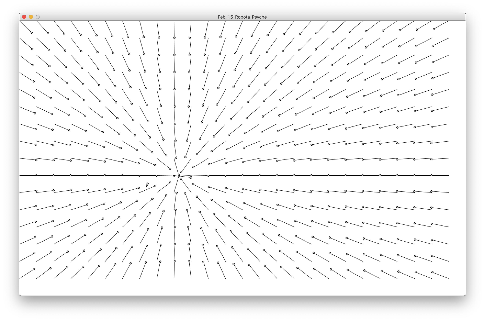
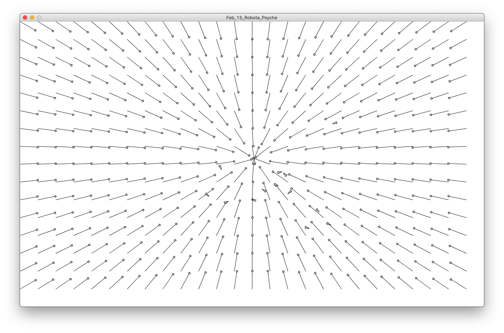
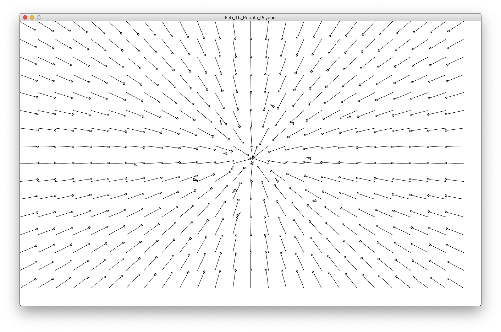

# Force Field Assignment #2

## Interesting things
I've learned something interesting with arrays. I had a hard time figuring out how to save shaped into an array because I understood array as a library that can save only variable, but thanks to the internet and Professor Shiloh, I was able to figure it out.

## Problems
I had problems setting how to make the vectors follow my cursor. I've watched some of Daniel Shiffman's videos on how to make vectors follow my cursor, and also Professor Sherwood's example, but I was not able to make what I wanted. For some reason the vector was stretching forever, and It was a very messy canvas.

I fixed it with making the length of the vector to the scale of whatever I put int (which is not the correct way), and then rotated each vector to an angle (described in Daniel Shiffman's video). This made a force field that did not directly point to my mouse cursor, but instead making it swirly towards the cursor.

And now after having class, I knew what my problem was. I didn't have to rotate my vectors nor subtract the values one by one, but instead make two new vectors and use the .sub function to calculate it, and normalize it at the same time.

'''
float xVec= mouseX-(i*g);
float yVec = mouseY-(j*g);
field[i][j] = new PVector (xVec, yVec)
'''

'''
PVector mouse = new PVector(mouseX, mouseY);
PVector location = new PVector(i*g, j*g);
PVector finalVec = PVector.sub(mouse,location);
finalVec.normalize();
field[i][j] = finalVec;
'''

## Final

