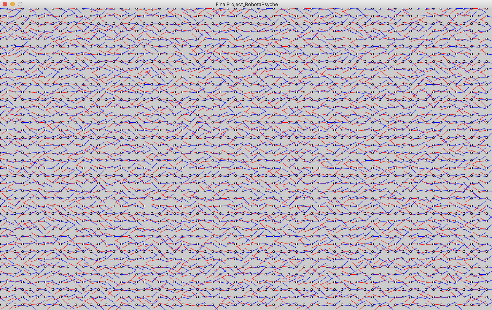

# Final Project - Basketball Simulation - Journal

[Day 1](journal.md@day-1); [Day 2](journal.md#day-2); [Day 3](journal.md#day-3); [Day 4](journal.md#day-4); [Day 5](journal.md#day-5); [Day 6](journal.md#day-6)

## Plans before start coding / concept
Since I play basketball a lot, I thought of making a basketball game simulation. The simulation will be in bird view where 5 people on each team have different team colors. The team that has the ball will be set into a flow field of going towards the rim on the other side of the court, while trying to avoid the other team players. On the other hand, the defending team will be attracted to the closest opponent player and follow that player. But all of the five defending player will be attracted the most to the player that currently has the ball (I probably change it to how players are strongly attracted to the ball directly). When the defender and the attacker with the ball collides, the defender steals the ball and will attack towards the other side of the court with the same rules applied.

So in other words, it will be like a total simulation of a basketball game between two teams.

### Day 1 (4/20)
Before making anytypes of vehicles (like players), I decided to make the flowfield first. I had no idea how I am supposed to make a flow field all point towards a certain point, so decided to first make a flow field for the left team. The function for this flowfield was to help the left team players move towards the other side of the court, but I gave random angles of the vector between -PI/4, PI/4 so that the flowfield will eventually send the players to the right, but will give a shaky movement. I wanted to put this effect because, first of all it would be too boring if the players went straight towards the rim, and second, the shaky effect will look like as if the players are dribbling the ball from left to right and right to left. I made a similar flowfield for the right team as well.

The next thing i did was to make a two different PVectors as lookups so that the vehicles(players) made later will be able to follow their corrresponding flowfields. 

Except for the fact that I had trouble thinking of making more than one flowfields, I was pretty okay with my project so far.

### Day 2 (4/23)
After making the flow field, I moved on to make the vehicles. I remember professor giving me an advice to make just two vehicles, one for each team at first, and build more after everything works fine.

So I started of with making the left team. I wanted to place the players on the right position so I decided to get two floats, for the location of the vehicle's initial location. Then I made two functions that returns the location of the vehicle's x and y position. I also updated the the players, and also made the players follow the flowfield in the follow() function. Lastly, I made a display function. I copied the whole code and pasted it on to the class for right team as well.

Finishing the codes, I needed to check if they actually work. So before putting a background, I made my two flowfields visible with the display function and set the initial location of two players in the middle of the canvas on each sides. And because I will make more players, I've created two arraylists one for the players on the right team and another for the left team.

### Day 3 (4/24)

### Day 4 (4/29)

### Day 5 (5/1)

### Day 6 (5/2)

